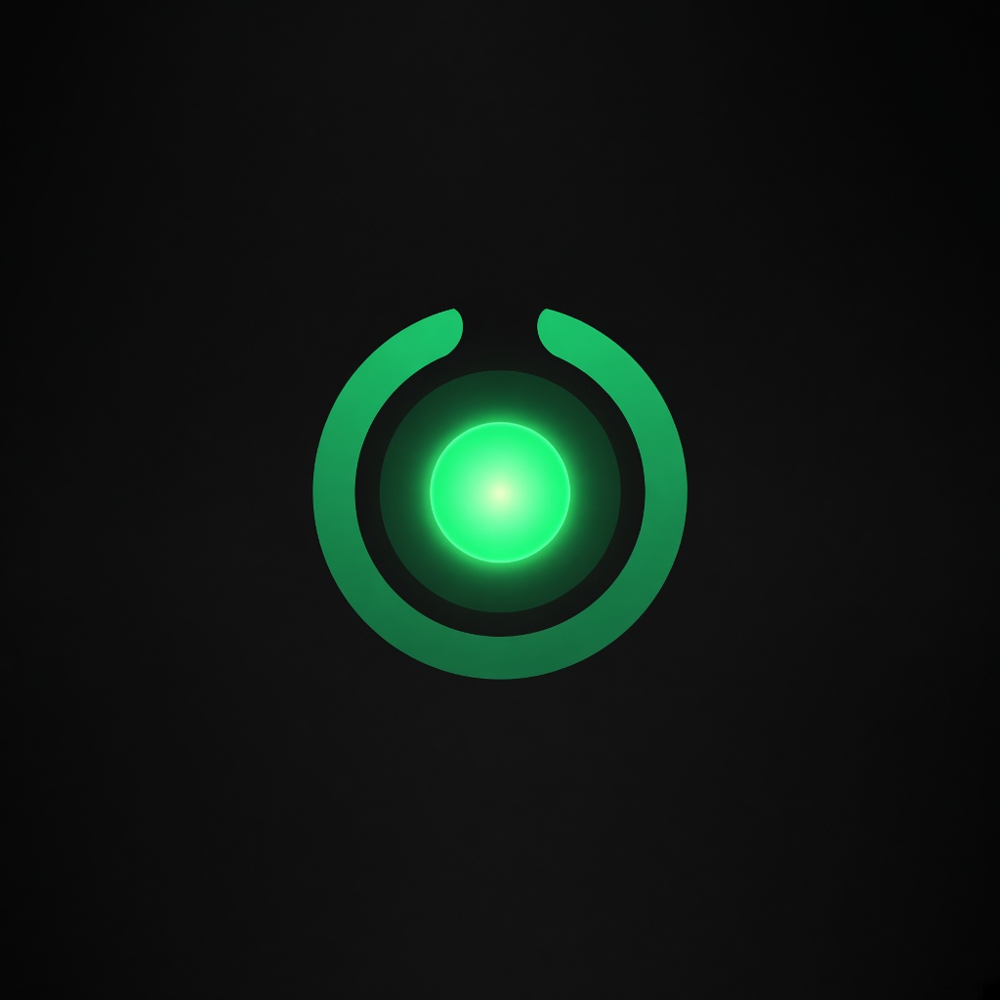
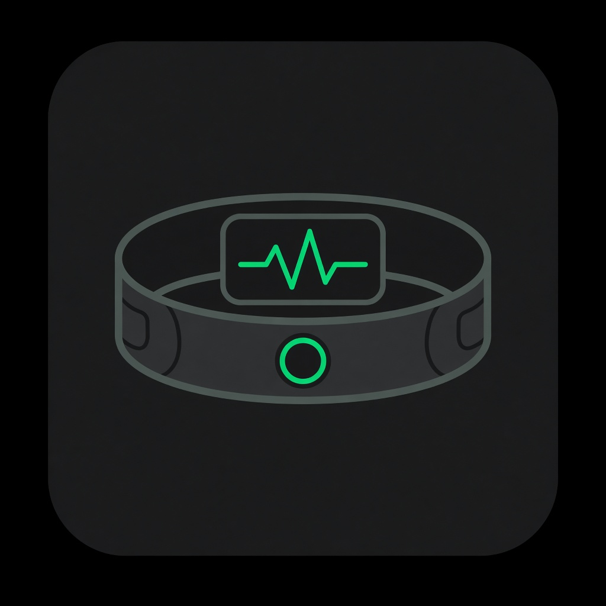
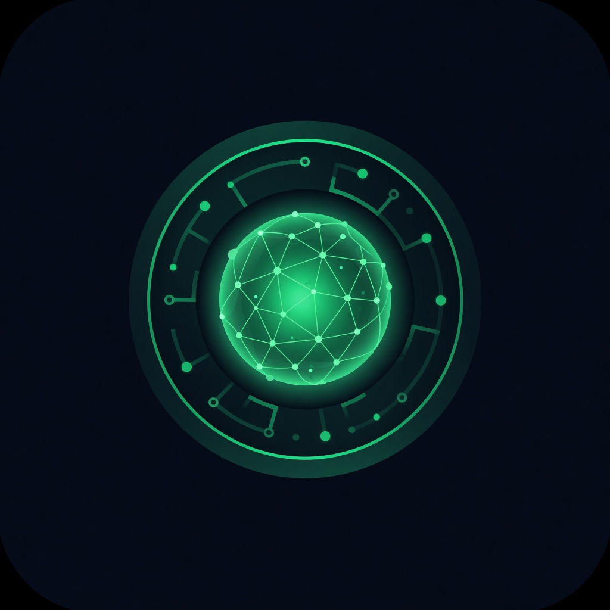
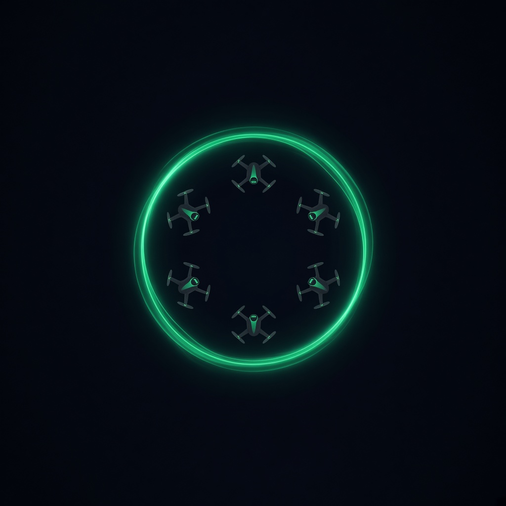
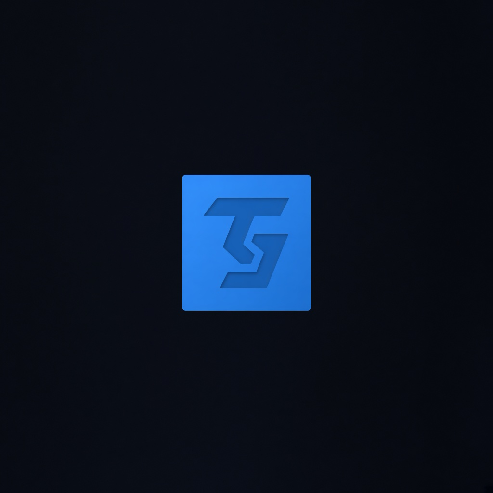
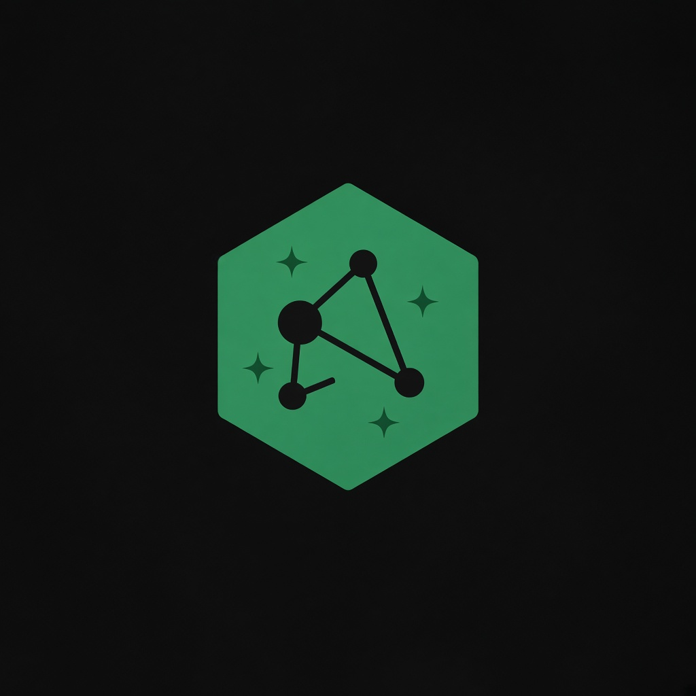

# Lanturn Light

<p align="center">
  
</p>

<p align="center">
  
  &nbsp;
  
  &nbsp;
  
  &nbsp;
  
  &nbsp;
  
  &nbsp;
  
</p>

**A buildable Green Lantern ring.**

A ring is three technologies stacked:

1. **Will-to-command** — reads intention and obeys. Real version: EMG / EEG / voice / gesture. Prototype-grade hardware exists today.
2. **The AI inside the ring** — advises you, plans constructs, talks back. Wire this to a local brain or your chat agent.
3. **Hard-light constructs** — physics wall on true solid light. Nearest real stand-ins: optical tweezers, mid-air plasma voxels, acoustic levitation… and the thing you can actually order parts for: **a drone swarm**.

The drones *are* your constructs: will-commanded, formation-formed, mission-executed. They can shape-shift, carry, project. Force at a distance with **nothing** at the target stays unsolved — that's the true ring magic. Everything else is a build plan.

## Stack

```
Will  →  Brain  →  Construct
EMG/text   LocalRingBrain / LLM   DroneSwarmConstruct
```

| | Layer | Module | What you swap later |
|---|-------|--------|---------------------|
|  | Will | `TextWill`, `SimulatedEmgWill`, `AdapterWill` | BLE EMG band, EEG headset, mic STT |
|  | Brain | `LocalRingBrain`, `DelegateBrain` | Fine-tuned model / Cursor agent / Ollama |
|  | Construct | `DroneSwarmConstruct` | Real MAVLink / Crazyflie / custom swarm |

Built with  TypeScript and  Node.

`HardLightStub` exists only to refuse the physics lie out loud.

## Install

```bash
npm install
npm run build
npm test
npm run example
```

## Pulse the ring

```ts
import {
  DroneSwarmConstruct,
  LanternRing,
  LocalRingBrain,
  TextWill,
} from "lanturn-light";

const ring = new LanternRing({
  will: new TextWill("form a shield", 0.95),
  brain: new LocalRingBrain(6),
  construct: new DroneSwarmConstruct(6),
});

const mission = await ring.pulse();
console.log(mission.brain.voice);
console.log(mission.swarm.formationLabel);
```

## What this is not

- Not solid photons. Light has no rest mass; photons don't bind into walls.
- Not telekinesis. If nothing is at the target, you can't push it — yet.

## What this is

~70% of a Lantern ring as engineering: intention in, mind in the loop, constructs in the field. The voice in the ring can be you, me, or any model you plug into `DelegateBrain`.

## Repo

https://github.com/AaronGrace978/Lanturn-Light
